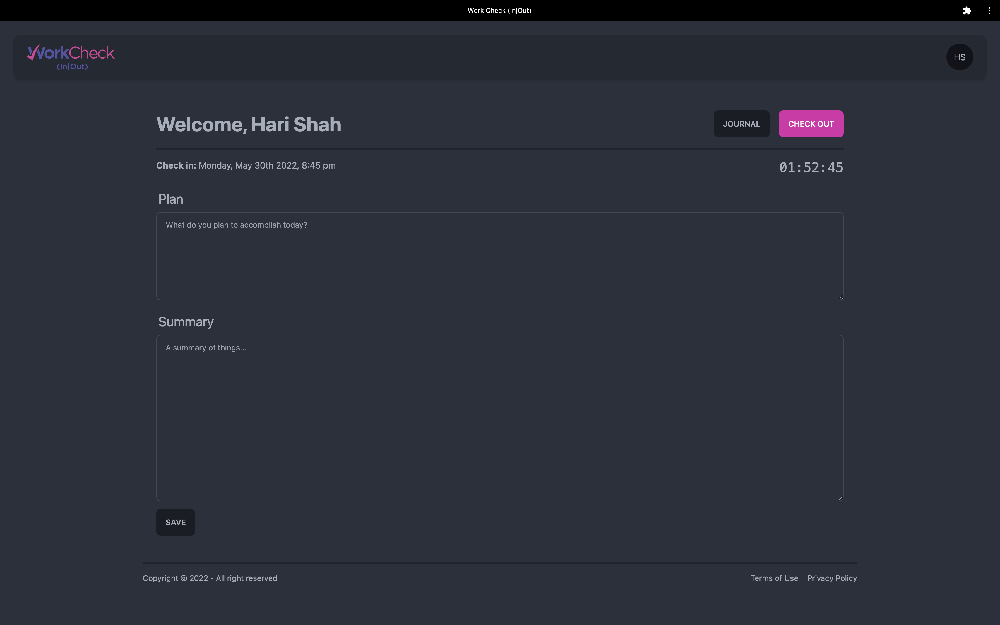

# Work Check (In|Out)

A productivity application which is a work journal with check in and check out feature for time and performance tracking.

This application is built using MERN stack as well as Apollo Graphql. It uses addtional package libraries like DaisyUI, TailwindCSS and MomentJS.

## Table of Contents

- [Installation](#installation)
- [Usage](#usage)
- [License](#license)
- [Contributing](#contributing)
- [Tests](#tests)
- [Questions](#questions)

## Installation

_This web application is an installable PWA (Progressive Web Application)_

1. Access the application via the [deployed url](https://work-check-io.herokuapp.com)
2. On phone: add a shortcut to the homescreen
3. On computer: using chrome you will be able to install the application from the address bar.

## Usage

This app is intended to be used for productivity purposes. You can plan, summarise in an entry daily and then track your productity through journal. To access the application features:

1. **Register**: create an account
2. **Sign in**: you can use the created account to access your information
3. **Check in**: you can create an entry by entering information on your planning and then summary nearing the end of day
4. **Check out**: at the end of you day you can assess your day by entering productivity and mood
5. **Journal**: as you keep adding entries on a regular basis you will be able to view a big picture and track your entries
6. **Profile**: you can manage and update your profile information or login password.

## License

This project is covered under: **GNU GPLv3**

Permissions of this strong copyleft license are conditioned on making available complete source code of licensed works and modifications, which include larger works using a licensed work, under the same license. Copyright and license notices must be preserved. Contributors provide an express grant of patent rights.

For license details: [click here](https://choosealicense.com/licenses/gpl-3.0/)

## Contributing

If you're interested in contributing to this project, please clone this repo, make improvements and open a pull request with description of the improvements.

## Tests

To test this application, please write the test file using your preferred testing framework ad run `npm run test` in your terminal.

## Questions

- This project is created and maintained by: [hari-ls](https://github.com/hari-ls)
- If you have addtional questions about this project, please feel free to reach out at: [hari@logicsync.com.au](mailto:hari@logicsync.com.au)
